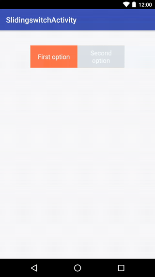

# SlidingSwitch

[](https://jitpack.io/#techisfun/SlidingSwitch)
[](https://travis-ci.org/TechIsFun/SlidingSwitch)
[]( https://android-arsenal.com/details/1/6447 )

A sliding-switch widget for Android



## Download

```
dependencies {
  compile 'com.github.techisfun:slidingswitch:0.3'
}
```

## Example usage

- Add the view to your layout:

```xml
<com.github.techisfun.slidingswitch.SlidingSwitch
        android:id="@+id/sliding_switch"
        android:layout_width="250dp"
        android:layout_height="wrap_content"
        app:paddingHorizontal="12dp"
        app:paddingVertical="8dp"
        app:firstOption="First option"
        app:secondOption="Second option"
        app:backgroundColor="#dce4e6"
        app:foregroundColor="#fc6c4f"
        android:textSize="20sp"
        android:layout_centerHorizontal="true"
        android:layout_marginTop="40dp"
        />
```

- Then set the listener:

```java
    SlidingSwitch slidingSwitch = 
        (SlidingSwitch) findViewById(R.id.sliding_switch);
    
    slidingSwitch.setSlideListener(new SlideListener() {
        @Override
        public void onFirstOptionSelected() {
            Toast.makeText(context, "First option selected", Toast.LENGTH_SHORT).show();
        }

        @Override
        public void onSecondOptionSelected() {
            Toast.makeText(context, "Second option selected", Toast.LENGTH_SHORT).show();
        }
    });
```

## Apps using this library
* [Musement](http://bit.ly/29OYH1w)


License
-------

    Copyright 2017 Andrea Maglie

    Licensed under the Apache License, Version 2.0 (the "License");
    you may not use this file except in compliance with the License.
    You may obtain a copy of the License at

       http://www.apache.org/licenses/LICENSE-2.0

    Unless required by applicable law or agreed to in writing, software
    distributed under the License is distributed on an "AS IS" BASIS,
    WITHOUT WARRANTIES OR CONDITIONS OF ANY KIND, either express or implied.
    See the License for the specific language governing permissions and
    limitations under the License.

